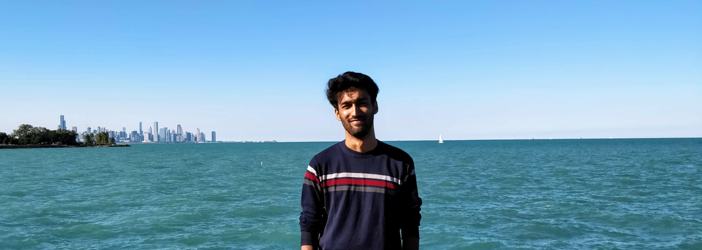

As this is my first ever blog post, we're due for introductions.  
{:class="img-responsive"}
I'm ***Sushant Bansal*** currently enrolled in the Masters Program in Computer Science at the University of Chicago.  I started a year ago in September and if everything goes according to the plan I'll graduate in December. I started grad school right after I finished my undergrad. This was the big step in my life moving to a new country with no contacts or relations. I must say I was a bit afraid but everything has turned out pretty good. Not exactly how I imagined it would be but still amazing nonetheless. I started grad school right after undergrad, it might not have been the wisest decisions. But yet, I have enjoyed my time here in the US, I like Chicago!

I always thought about writing a blog but it never felt like the right time. But now, it does. There are a lot of changes that have happened in the past year which are intriguing and interesting. For example, I wasn't able to eat pasta because I felt it was toooo spicy. I still think it was, but my friends did not agree and seemed to enjoy the dish a lot. Also, I have grown a lot since last year, both in my professional and personal life. And now I want to share both of those things with you all.  

I plan to write about some of my experiences in Chicago and the computer science stuff that I've learned. I'll write about the places I visited and the projects that I worked on or working on. Every project has a story and for me, this would be the place to tell the story to you all. I recently went to John Mayer's concert and I have a lot of thoughts, which I want to share. Or something like how I am in awe of Neural Networks. I want to write about it all. It's going to be fun! My tech posts will be easy to follow but they won't be like a tutorial. I will talk about the technologies I used, and why I used them. What were the challenges I faced and how did I work through them? Also, I will talk about what led me here, that is where I am in my life right now. Hopefully, some of you will be able to relate to these posts on some levels and enjoy them. 

It would be nice to know what you think about what I'm writing about. I'll be happy to answer questions about moving to the US, things I wish I knew before I came here. You can always leave a comment below or send me a message/email, I'll be happy to talk. 
I don't want the first post to be really long, so I'll stop here. 

Thank you for being here and reading this. I hope I'll be able to engage you with my future posts. Until next time!

