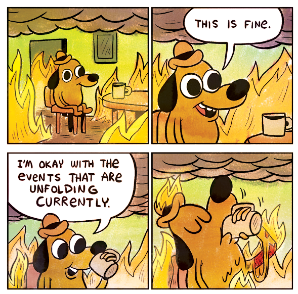

{:class="img-responsive"}
It's been like that since October, 2018. Okay, that might be a little bit of an exaggeration, but let me try to put some more context here. 

After a 22 hour journey which started at  4:15 AM New Delhi, India on September 11, 2019 I landed in Chicago around 5:00 PM. And it was still September 11, 2019 and the sun was still up in all it's glory. I took a cab and came to the campus, The Joseph Regenstein Library. 
The first thing that I noticed that on campus was the air felt lighter than usual. Then was the lack of homo sapiens, it was really quiet. I was still trying to accept the reality that I was in the U.S. it was problematic because it was so normal. Nothing really had changed, I was a student again at the University.  I had the famous Chicago deep dish pizza for dinner, it didn't seem to enjoy it. And the next morning after that, I went to the famous Valois restaurant where Barack Obama used to eat breakfast. I really enjoyed this meal. After a couple of days, I moved into my apartment. And this concludes the initial move to the US. 

The fire started when I wrote my initial Math exam to waive off a prerequisite. Me and my roommates all failed. It was a setback but not so much. I just had to take an extra math class, which turned out to be a good class. And also to help with everything there were a lot of orientations, mixers and more. All with free food and drinks, so I was still enjoying. But then suddenly two weeks had passed and classes were starting the next day. 
